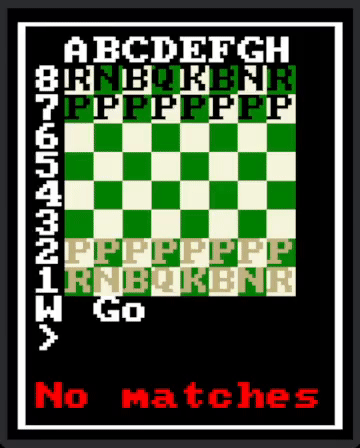

# ULTIMATE CHESS 2024
A basic chess game written in bevy.

Play it Now!
* [Web](https://sarda.dev/personal-projects#ultimate-chess-2024)
* [Windows](https://github.com/sardap/ultimate-chess-2024/releases)
* [Linux](https://github.com/sardap/ultimate-chess-2024/releases)

## Features
* Variants such as
    * Chess960
    * Horde
    * Kawns - What if all the pawns were knights?
    * Horsies - What if the back-rank was all knights?
    * Mid Battle - What if the pieces were like in the middle of it?
* Online Multiplayer!
    * Includes game-breaking bugs!
* Computer Players
    * Paul - A bot based on my positions and moves in chess, It's just as good as me!
    * Not Idiot - A bot which should not be a idiot.
    * The bogo twins
        * Bogo P - Moves a random piece
        * Bogo M - Makes a random move
    * Blundy - Attempts the worst move possible
        

